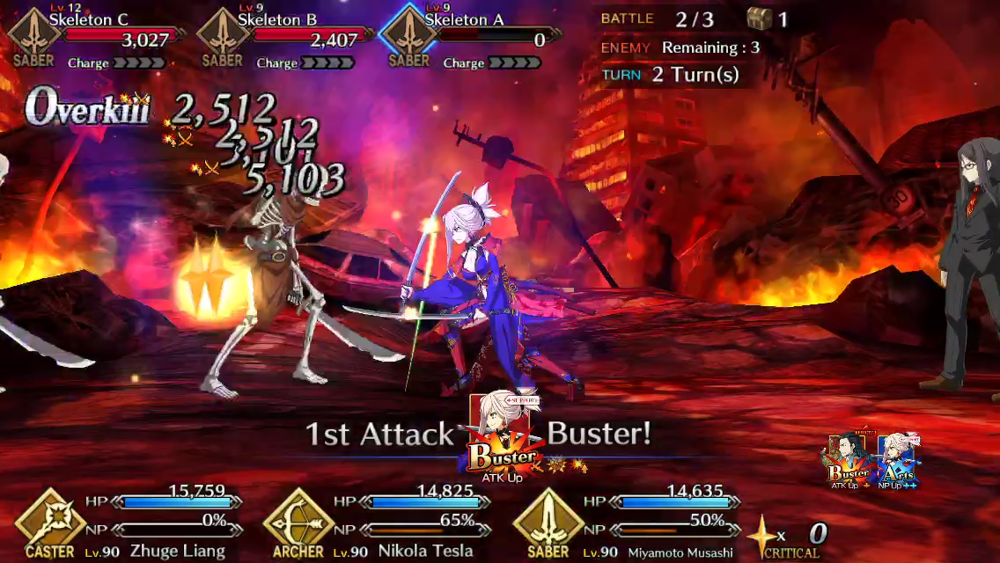
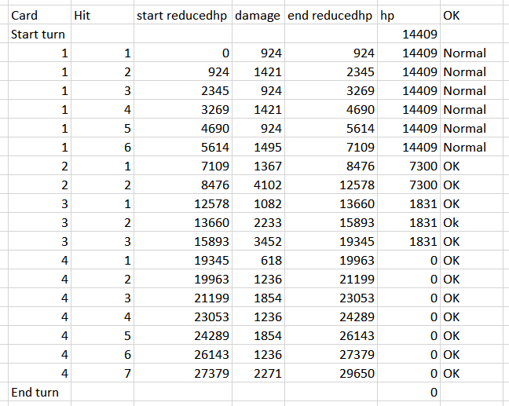
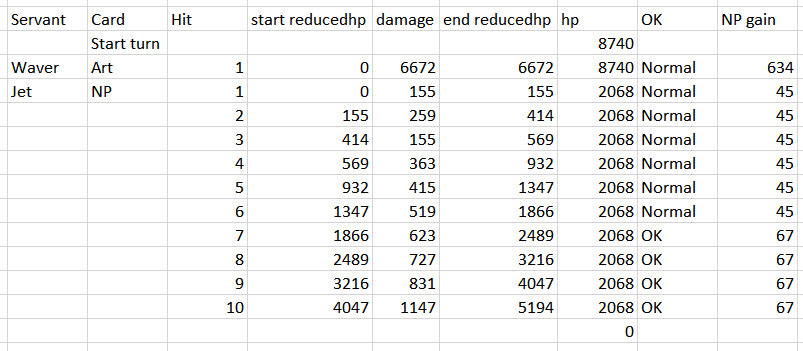

# Miscellaneous information about FGO gameplay

[](https://discord.gg/TKJmuCR)

Below is a collection of small posts about FGO mechanics. Most are originally discussed in the Atlas Academy discord server.

- [Range of `randomModifier` in the damage formula](#range-of-randommodifier-in-the-damage-formula)
- [Maximum value of total `powerMod`](#maximum-value-of-total-powermod)
- [`enemyServerMod` in the NP gain formula](#enemyservermod-in-the-np-gain-formula)
- [How MISS and GUARD are determined](#how-miss-and-guard-are-determined)
- [How the special summoning effects work](#how-the-special-summoning-effects-work)
- [Why does the last hit have different damage value compared to a prior hit when they have the same damage distribution?](#why-does-the-last-hit-have-different-damage-value-compared-to-a-prior-hit-when-they-have-the-same-damage-distribution)
- [How the Overkill bug happens](#how-the-overkill-bug-happens)
- [Lists of Mystic Code skills that have 500% chance in JP but 100% in NA](#lists-of-mystic-code-skills-that-have-500-chance-in-jp-but-100-in-na)

### Range of `randomModifier` in the damage formula

An integer in the range [900, 1100):

- 900: inclusive lower bound (0.9 `randomModifier` is possible)
- 1100: exclusive upper bound (1.1 `randomModifier` is **not** possible)

[C# method reference](https://docs.microsoft.com/en-us/dotnet/api/system.random.next?view=netframework-4.8#System_Random_Next_System_Int32_System_Int32_).

### Maximum value of total `powerMod`

1000%.

### `enemyServerMod` in the NP gain formula

[The NP gain formula](https://blogs.nrvnqsr.com/entry.php/3306-How-much-NP-do-I-get-in-combat).

The `enemyServerMod`s in the attacking and defending formulas refer to two different variables in the enemy data: `tdRate` for attacking NP gain and `tdAttackRate` for defending NP gain. They are usually the same but there's no code requirement for them to be the identical.

### How MISS and GUARD are determined

MISS and GUARD are only for display, the proc check is still as described in [Kyte's post](https://blogs.nrvnqsr.com/entry.php/3311-How-is-effect-success-rate-calculated). Here's how they are determined:

* num3 = status effect chance
* random roll = random integer in range [0, 1000)
* num2 = target's resistance + random roll
* if num2 > num3: buff fails
  * if num2 > 1000 (100%): it displays GUARD, otherwise MISS

As a result of this, a failed 100% chance status effect can only display GUARD.

For example, with Shuten's first skill (60% chance Charm, 100% chance DEF down) against shadow Medusa in the X-E FQ with 17.5% resistance:

* Charm effect:
  * Example 1:
    * num3 = 600
    * random roll = 876
    * num2 = 876 + 175 = 1051
    * 1051 > 600 -> buff fails
      * 1051 > 1000 -> displays GUARD
  * Example 2:
    * num3 = 600
    * random roll = 598
    * num2 = 598 + 175 = 773
    * 773 > 600 -> buff fails
      * 773 < 1000 -> displays MISS
* DEF down effect:
  * Example 1:
    * num3 = 1000
    * random roll = 928
    * num2 = 928 + 175 = 1103
    * 1103 > 1000 -> buff fails
      * 1103 > 1000 -> displays GUARD
  * Example 2:
    * num3 = 1000
    * random roll = 761
    * num2 = 761 + 175 = 936
    * 936 < 1000 -> buff procs

### How the special summoning effects work

[Reddit post](https://www.reddit.com/r/grandorder/comments/9pmta4/the_truth_in_code_summoning_gold_orbs_rainbow/) about gold orbs, rainbow orbs and silver to gold conversions.

### Why does the last hit have different damage value compared to a prior hit when they have the same damage distribution?

The following formula applies to all hits' damage except for the last one:

Hit damage = Card damage × Hit Percentage / Sum of hits percentage (Note that `/` is [integer division](https://docs.microsoft.com/en-us/dotnet/csharp/language-reference/operators/arithmetic-operators#integer-division))

The last hit's damage is calculated by subtracting the previous hits' damage from the card damage.

Therefore, the last hit's damage can be different from a prior hit's even with the same hit percentage. For example, Musashi's Buser card has `[33, 67]` damage distribution. With her first skill active, the damage distribution array becomes `[33, 33, 67, 67]`. With card damage of 15,228, the hits damage are `[2512, 2512, 5101, 5103]`:

```python
>>> 15228 * 33 // 200 # Hit 1; "//" is integer division
2512
>>> 15228 * 33 // 200 # Hit 2; 33+33+67+67=200
2512
>>> 15228 * 67 // 200 # Hit 3
5101
>>> 15228 - 2512 - 2512 - 5101 # Hit 4
5103
```

<div style="text-align:center"></div>

### How the Overkill bug happens

What is the Overkill bug?

> For cards (not NPs), if you hit an enemy below **half of the HP they had at the start of the current turn** you get 1.5x NP gain as if you were overkilling.

To determine which hit should have the overkill effect, the game keeps track of provisional damage between hits and compares it with the target's HP value. The target's HP is updated between cards while the provisional damage counter is not reset between cards. This leads to double counting of damage dealt and the effect of OK when the target's HP is less than half of its start value.

Here are some examples of how the game determines when the overkill effect applies and the overkill bug in action.

* Explanations of the tables' columns: 
  * `reducedhp` is the provisional damage counter:
    * `reducedhp` is updated every hit
    * `reducedhp` starts at 0
    * `start reducedhp` + `damage` = `end reducedhp`
    * `start reducedhp` = usually previous hit's `end reducedhp` (see the Lancelot NP case for a different case)
  * `hp` is the target's HP value used for comparision with `reducedhp`:
    * `hp` is updated between cards
  * `OK` is whether the hit has overkill effect:
    * `end reducedhp` < `hp` -> Normal
    * `end reducedhp` > `hp` -> OK

* Scathach BQAE:

Scathach's quick card and first hit of the arts card experience overkill effect before she kills the target. Because the `hp` value is updated after the first card (14409 to 7300) while `reducedhp` is carried over from the first card, the overkill bug happens.

<div style="text-align:center"></div>

* Lancelot NP:

`reducedhp` is properly reset for Lancelot's NP card so the bug doesn't happen here. NP gain value is also shown in the table.

<div style="text-align:center"></div>

* MHXA BAQE:

A video of the bug in action: https://www.bilibili.com/video/av34113229 @ 1:42. MHXA Arts card 2nd hit has the overkill bug.

<div style="text-align:center"></div>

### Lists of Mystic Code skills that have 500% chance in JP but 100% in NA

* Mystic Code: Chaldea 
  * 2: Instant Enhancement
  * 3: Emergency Evade
* Mystic Code: Chaldea Combat Uniform
  * 1: Buff All Allies
  * 2: Gandr
* Mystic Code: Atlas Institute Uniform
  * 1: Dust of Osiris
  * 2: Rain of Isis
* Anniversary Blonde
  * 1: Mana Burst
  * 3: Knight's Oath
* Royal Brand  
  * 1: Reaction Reinforcement 
  * 2: Iron Devotion
  * 3: Inescapable
* Brilliant Summer  
  * 1: Rumble Party
  * 2: Deadly Trident
* Memories of the Lunar Sea  
  * 1: Spiritron Boost
  * 2: Stepping Stone to Ultimate Victory
* Memories of the Far Side of the Moon  
  * 1: Spiritron Boost (All)
  * 2: Stepping Stone To Surviva
