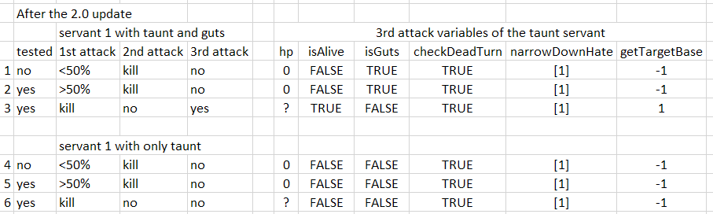
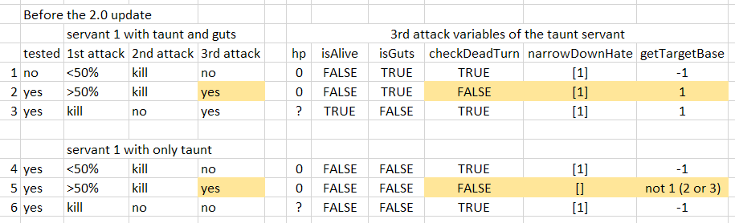

<!-- omit in toc -->
# Miscellaneous information about FGO gameplay

[](https://discord.gg/TKJmuCR)

Below is a collection of small posts about FGO mechanics. Most are originally discussed in the Atlas Academy discord server.

- [Range of `randomModifier` in the damage formula](#range-of-randommodifier-in-the-damage-formula)
- [Maximum value of total `powerMod`](#maximum-value-of-total-powermod)
- [`enemyServerMod` in the NP gain formula](#enemyservermod-in-the-np-gain-formula)
- [How MISS and GUARD are determined](#how-miss-and-guard-are-determined)
- [How the special summoning effects work](#how-the-special-summoning-effects-work)
- [How hit damage is distributed](#how-hit-damage-is-distributed)
- [How the Overkill bug happens](#how-the-overkill-bug-happens)
- [Enemy behavior after killing taunt servant](#enemy-behavior-after-killing-taunt-servant)
  - [Pre 2.0 update behavior](#pre-20-update-behavior)
- [Lists of Mystic Code skills that have 500% chance in JP but 100% in NA](#lists-of-mystic-code-skills-that-have-500-chance-in-jp-but-100-in-na)

### Range of `randomModifier` in the damage formula

An integer in the range [900, 1100):

- 900: inclusive lower bound (0.9 `randomModifier` is possible)
- 1100: exclusive upper bound (1.1 `randomModifier` is **not** possible)

[C# method reference](https://docs.microsoft.com/en-us/dotnet/api/system.random.next?view=netframework-4.8#System_Random_Next_System_Int32_System_Int32_).

### Maximum value of total `powerMod`

1000%.

### `enemyServerMod` in the NP gain formula

[The NP gain formula](https://blogs.nrvnqsr.com/entry.php/3306-How-much-NP-do-I-get-in-combat).

The `enemyServerMod`s in the attacking and defending formulas refer to two different variables in the enemy data: `tdRate` for attacking NP gain and `tdAttackRate` for defending NP gain. They are usually the same but there's no code requirement for them to be the identical.

### How MISS and GUARD are determined

The status effect proc check is still as described in [Kyte's post](https://blogs.nrvnqsr.com/entry.php/3311-How-is-effect-success-rate-calculated). MISS and GUARD are only for display. Here's how they are determined:

* num3 = status effect chance
* random roll = random integer in range [0, 1000)
* num2 = target's resistance + random roll
* if num2 > num3: buff fails
  * if num2 > 1000 (100%): it displays GUARD, otherwise MISS

As a result of this, a failed 100% chance status effect can only display GUARD.

For example, with Shuten's first skill (60% chance Charm, 100% chance DEF down) against shadow Medusa in the X-E FQ with 17.5% resistance:

* Charm effect:
  * Example 1:
    * num3 = 600
    * random roll = 876
    * num2 = 876 + 175 = 1051
    * 1051 > 600 -> buff fails
      * 1051 > 1000 -> displays GUARD
  * Example 2:
    * num3 = 600
    * random roll = 598
    * num2 = 598 + 175 = 773
    * 773 > 600 -> buff fails
      * 773 < 1000 -> displays MISS
* DEF down effect:
  * Example 1:
    * num3 = 1000
    * random roll = 928
    * num2 = 928 + 175 = 1103
    * 1103 > 1000 -> buff fails
      * 1103 > 1000 -> displays GUARD
  * Example 2:
    * num3 = 1000
    * random roll = 761
    * num2 = 761 + 175 = 936
    * 936 < 1000 -> buff procs

### How the special summoning effects work

[Reddit post](https://www.reddit.com/r/grandorder/comments/9pmta4/the_truth_in_code_summoning_gold_orbs_rainbow/) about gold orbs, rainbow orbs and silver to gold conversions.

### How hit damage is distributed

The following formula applies to all hits' damage except for the last one:

Hit damage = Card damage × Hit Percentage / Sum of hits percentage (Note that `/` is [integer division](https://docs.microsoft.com/en-us/dotnet/csharp/language-reference/operators/arithmetic-operators#integer-division))

The last hit's damage is calculated by subtracting the previous hits' damage from the card damage.

Therefore, the last hit's damage can be different from a prior hit's even with the same hit percentage. For example, Musashi's Buser card has `[33, 67]` damage distribution. With her first skill active, the damage distribution array becomes `[33, 33, 67, 67]`. With card damage of 15,228, the hits damage are `[2512, 2512, 5101, 5103]`:

```python
>>> 15228 * 33 // 200 # Hit 1; "//" is integer division
2512
>>> 15228 * 33 // 200 # Hit 2; 33+33+67+67=200
2512
>>> 15228 * 67 // 200 # Hit 3
5101
>>> 15228 - 2512 - 2512 - 5101 # Hit 4
5103
```

<div style="text-align:center"></div>

### How the Overkill bug happens

What is the Overkill bug?

> For cards (not NPs), if you hit an enemy below **half of the HP they had at the start of the current turn** you get 1.5x NP gain as if you were overkilling.

To determine which hit should have the overkill effect, the game keeps track of provisional damage between hits and compares it with the target's HP value. The target's HP is updated between cards while the provisional damage counter is not reset between cards. This leads to double counting of damage dealt and the effect of OK when the target's HP is less than half of its start value.

Here are some examples of how the game determines when the overkill effect applies and the overkill bug in action.

* Explanations of the tables' columns: 
  * `reducedhp` is the provisional damage counter:
    * `reducedhp` is updated every hit
    * `reducedhp` starts at 0
    * `start reducedhp` + `damage` = `end reducedhp`
    * `start reducedhp` = usually previous hit's `end reducedhp` (see the Lancelot NP case for a different case)
  * `hp` is the target's HP value used for comparision with `reducedhp`:
    * `hp` is updated between cards
  * `OK` is whether the hit has overkill effect:
    * `end reducedhp` < `hp` -> Normal
    * `end reducedhp` > `hp` -> OK

* Scathach BQAE:

Scathach's quick card and first hit of the arts card experience overkill effect before she kills the target. Because the `hp` value is updated after the first card (14409 to 7300) while `reducedhp` is carried over from the first card, the overkill bug happens.

<div style="text-align:center"></div>

* Lancelot NP:

`reducedhp` is properly reset for Lancelot's NP card so the bug doesn't happen here. NP gain value is also shown in the table.

<div style="text-align:center"></div>

* MHXA BAQE:

A video of the bug in action: https://www.bilibili.com/video/av34113229 @ 1:42. MHXA Arts card 2nd hit has the overkill bug.

<div style="text-align:center"></div>

### Enemy behavior after killing taunt servant

With the 2.0 update*, DW fixed this enemy behavior to be mostly consistent. Enemy will stop attacking after killing the taunt servant except for the following case:

> If an enemy kills the taunt servant in the **first** attack action and the taunt servant has guts, the **second** attack action will not happen but the **third** attack action  will.

You can see this scenario in this [gif](https://imgur.com/WSxjitJ). Lalter attacked and killed Spartacus with guts. Tesla didn't attack and Siegfried attacked instead.

**Note:** With the 2.0 update, I'm quite sure the behavior is the same even with enemy NP attack or attack with on-hit effects (e.g. Hokusai 3rd skill).

You can see in the following image the reasons for the enemy behavior.

* Table columns:
  * Scenario number: `1-6`
  * `tested`: whether all of the variables values are verified in the actual game
  * `1st attack`: outright kills the taunt servant, deals more than 50% hp or deals less than 50% hp of damage
  * `2nd attack`: kills the taunt servant or doesn't happen
  * `3rd attack`: happens or doesn't happen
  * Internal game variables and functions during the 3rd attack:
    * `hp`: the hp value
    * `isAlive`, `isGuts`, `checkDeadTurn`: 3 boolean flags of the **taunt servant**
    * `narrowDownHate`: returns the list of player servants with taunt. For example, the input of the function is `[1, 2, 3]` and the first servant has taunt, the output is `[1]`.
    * `getTargetBase`: returns the first "eligible" servant of the input list

<div style="text-align:center"></div>

In all scenarios, even after the taunt servant is killed with or without guts, `narrowDownHate` returns the taunt servant, `[1]`. In scenarios 1, 2, 4-6, `getTargetBase` still considers `1` to be "dead" so it returns no eligible servant, `-1`, and there's no attack.

In scenario 3, the flag `isAlive` is switched to `True` in the 3rd attack as the guts servant `hp` value is updated. `getTargetBase` found an eligible servant and the 3rd attack happens (For the 2nd attack, `isAlive` is still `False`).

#### Pre 2.0 update behavior

The table below details the enemy behavior before the 2.0 update. The cells that changed with the 2.0 update are highlighted.

Generally, if the enemy deals more than 50% starting hp of damage and kills in the 2nd attack, there will be a 3rd attack.

**Note:** This doesn't apply to enemy NP attack or attack with on-hit effects (e.g. Hokusai 3rd skill).

<div style="text-align:center"></div>

The above conditions sound familiar? Yes, the overkill bug rears its head again. Because of the overkill bug, `checkDeadTurn` is set to `False` and wreaks havoc on the downstream functions:
* Because the first attack deals more than 50% starting hp of damage, on the 2nd attack, `reducedhp` is greater than `hp`. Therefore, the game thinks the taunt servant is already dead and doesn't record `deadTurn` when the enemy kills the taunt servant.
* As the overkill bug prevents `deadTurn` from being recorded on the 2nd attack, `checkDeadTurn` returns `False` on the 3rd attack. 
* `narrowDownHate` and `getTargetBase` behave differently with and without guts but essentially there will be a 3rd attack.

**Note:** I don't track the game code closely enough to know for sure that this behavior changes with the 2.0 update but the NA game code is definitely different between version 1.35.1 and 2.1.0. There's still this pre-2.0 [video](https://youtu.be/_5bFrrDGvro?t=140) that I haven't been able to explain.

<!-- TODO: Skill length -->

### Lists of Mystic Code skills that have 500% chance in JP but 100% in NA

* Mystic Code: Chaldea 
  * 2: Instant Enhancement
  * 3: Emergency Evade
* Mystic Code: Chaldea Combat Uniform
  * 1: Buff All Allies
  * 2: Gandr
* Mystic Code: Atlas Institute Uniform
  * 1: Dust of Osiris
  * 2: Rain of Isis
* Anniversary Blonde
  * 1: Mana Burst
  * 3: Knight's Oath
* Royal Brand  
  * 1: Reaction Reinforcement 
  * 2: Iron Devotion
  * 3: Inescapable
* Brilliant Summer  
  * 1: Rumble Party
  * 2: Deadly Trident
* Memories of the Lunar Sea  
  * 1: Spiritron Boost
  * 2: Stepping Stone to Ultimate Victory
* Memories of the Far Side of the Moon  
  * 1: Spiritron Boost (All)
  * 2: Stepping Stone To Survival
